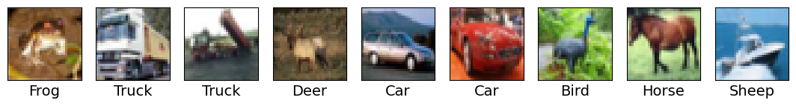

# 🖼️ CIFAR-10 Image Classifier Using the Neural-Networks

------------------------------------------------------------------------

## 🗂️ Project Structure

📁 **`Neural-Network-Classification.ipynb`** → Main Notebook\
- 📚 Imports: `tensorflow`, `keras`, `numpy`, `cifar10`\
- 📥 Loads CIFAR-10 dataset (60,000 images, 10 classes)\
- 🧹 Preprocessing: normalization, reshaping\
- 🧪 EDA optional: class names, image samples\
- 🧠 Build NN model (Dense layers + Dropout)\
- 📈 TensorBoard logging enabled

------------------------------------------------------------------------

## 🔍 Example Outputs

**Sample Images from CIFAR-10:**\

------------------------------------------------------------------------

## 🧠 Model Architecture

-   Dense Layer (ReLU)\
-   Dropout\
-   Softmax output (10 classes)

Classes: Plane, Car, Bird, Cat, Deer, Dog, Frog, Horse, Sheep, Truck

------------------------------------------------------------------------

## 🤖 Training Pipeline

-   Load CIFAR-10\
-   Normalize\
-   Build Sequential model\
-   Train\
-   TensorBoard logging\
-   Evaluate

------------------------------------------------------------------------

## 📈 Model Performance

  Accuracy   \~60%+

------------------------------------------------------------------------

## ⚙️ Future Upgrades

-   CNN\
-   Data augmentation\
-   BatchNorm\
-   Model saving

------------------------------------------------------------------------

## ✨ Credits

Built with TensorFlow, Keras, and lots of patience.
